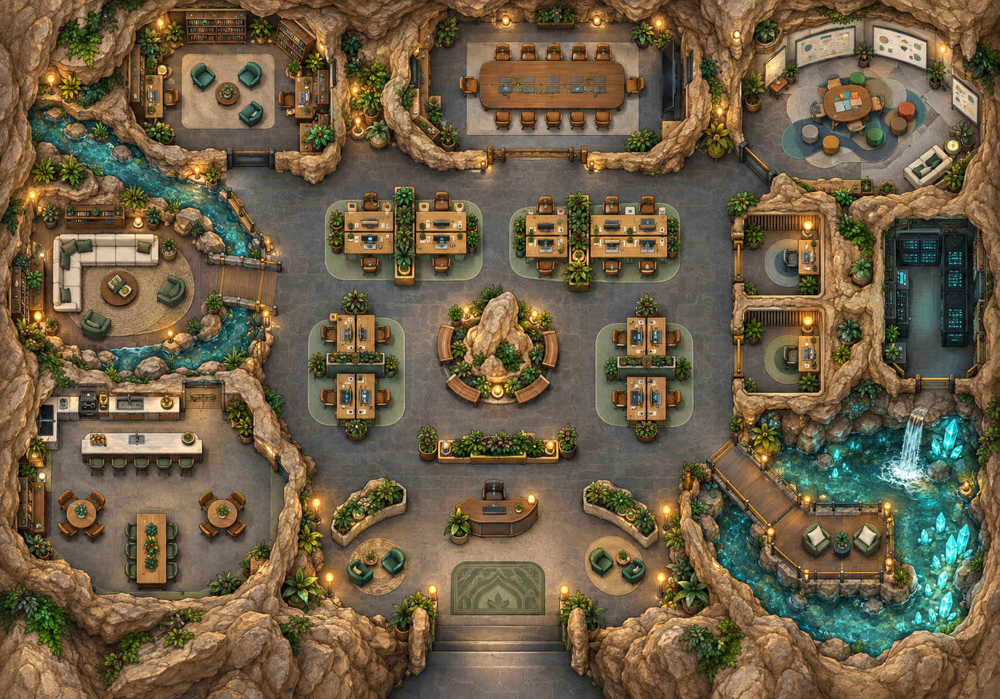

# Atrium

<p align="center">
  
</p>

**Atrium is a 2D virtual office with *proximity voice*.** You walk in as a pixel
character on the map above, move with WASD, and other people's voices fade in as you
get closer and fade out as you walk away — exactly the way a real office sounds. There
is no "join meeting" button: if you want to talk to someone, you walk to their desk.

The map itself is a single office inside a cave: reception at the entrance downstairs,
two meeting rooms and an open-plan area in the middle, a pantry and lounge on the left,
the server room and phone booths on the right, and a wooden deck over the crystal pool
for the unhurried conversations. Every rock, pool and piece of furniture really does
block the way — the server validates each step too, so you cannot walk through walls.

### What's in it

- **Proximity voice** — a WebRTC mesh, volume following distance (`NEAR`/`FAR` in `public/geom.js`), and a pulsing green ring around anyone who is speaking.
- **Walkie-talkie** — hold `T` to broadcast to the whole floor: one channel, one speaker at a time, with an on-screen handset and band-limited radio audio.
- **Chat, reactions, and polls** — `Enter` to type, `@name` for a private message, hover a message to react with an emoji, `/vote Where for lunch? | Padang | Satay` to put a poll in the room.
- **51 interactive seats** — walk up to a chair and press `E` to sit; one person per chair.
- **Desk games** — sit at a chair facing a monitor and a game menu appears: **Gaple**, **Tumble Rush**, or **Werewolf**, running as an overlay inside the office.
- **Ten characters** — picked before you join, with walking and sitting/talking sprites from `assets/characters/`.

### How it works (in brief)

`server.js` (Express + Socket.IO) owns player state, seats, the walkie channel, and
chat history — all in memory, all gone on restart. The client in `public/` draws the
map and the players to a `<canvas>` (`public/office.js`, `public/sprites.js`), handles
spatial audio (`public/rtc.js`, `public/geom.js`), and runs the walkie handset
(`public/walkie.js`). The three games under `games/` are separate Node servers that the
office iframes. Voice travels directly between participants over WebRTC, so the server
never touches audio.

### Quick start

```bash
npm install
npm start          # http://localhost:3100  (office only)
npm run start:all  # office + all desk games together
```

Open two tabs, Join in both, and allow the microphone. **Use headphones** or the two
tabs will feed back. Move with WASD or the arrow keys. Press `` ` `` to draw the audio
range rings. Press `Enter` to chat and `Escape` to get movement back. Hover a message to
react to it with an emoji, and type `/vote Where for lunch? | Padang | Satay` to put a
poll in the room. A green ring pulses around anyone who is speaking, including people
too far away to hear — that is the cue to walk over.

To bring in someone on another device, the browser requires https — see
[Testing with someone else on your LAN](#testing-with-someone-else-on-your-lan) or
[Deploy with Docker](#deploy-with-docker) below.

## Deploy with Docker

Runs the office and all three desk games as separate containers, mirroring
`npm run start:all`:

```bash
docker compose up --build -d
```

Then open `http://<server-host>:3100`. `docker compose logs -f` to watch it,
`docker compose down` to stop, `docker compose up --build -d` again after pulling
new code. Each service is its own image built from the repo root (`Dockerfile`,
`games/gaple/Dockerfile`, `games/tumble/Dockerfile`, `games/werewolf/Dockerfile` —
they need the repo root as build context because the games `require('../serve')`),
and comes up on the same ports as running things with `npm`: 3100/3200/3300/3400.

### HTTPS on a real server

Browsers only hand out a mic on a secure origin — `localhost` counts, a public IP or
domain does not — and an https page can't iframe an http one, so a public deployment
needs https on **all four ports**, for the same hostname (the office reaches a game
at `location.hostname:<port>`). Two ways to get there, both already wired into
`docker-compose.yml`:

1. **Give each container the certificate directly.** Put `cert.pem` + `key.pem` in
   `./certs/` on the host and restart the stack (`docker compose up -d
   --force-recreate`) — every container mounts that folder read-only and turns on
   https by itself the moment it finds a cert there, no reverse proxy needed.
   - Have a domain? Get a real one for it (certbot, your host's panel, etc.) and
     drop it in — no more browser warning.
   - Only have a public IP (no domain yet)? Run `./scripts/make-server-cert.sh`
     (auto-detects the IP, or pass it as an argument) — it makes the same kind of
     self-signed cert `make-cert.sh` makes for a LAN IP, just for your server's
     public one.
2. **Terminate TLS in front instead** (Caddy, nginx, Traefik, a cloud load balancer…)
   and forward plain http to the containers' published ports. If you go this route,
   leave `./certs/` empty so the containers themselves stay on http behind the proxy.

Either way, open a firewall for 3100-3400 (or whatever you remap them to) and point
DNS at the box if you have one. With a self-signed cert (option 1's second bullet),
each of the four ports also needs opening once in a plain tab and clicking through
the browser's warning (Advanced → Proceed) before the office overlay can load it — a
real certificate doesn't have that problem.

> **"Mic access failed: Cannot read properties of undefined (reading
> 'getUserMedia')"** means the browser decided the page isn't https (or isn't
> `localhost`) and didn't give it a `mediaDevices` API at all — this is the fix.

### What Docker doesn't change

Voice is still a WebRTC mesh with no TURN server (see "Limits" below) — fine on a LAN,
but players behind strict/symmetric NATs on the open internet may fail to connect to
each other even once the server itself is reachable. Chat history and the desk games'
tables are in-memory and reset on container restart; nothing here is persisted to a
volume.

## Desk games

Sit on a chair that faces a monitor (reception desk, phone booths, the open-plan
pods) and the break-time menu pops up: **Gaple**, **Tumble Rush**, or **Werewolf**.
Pick one and it runs in an overlay right inside the office — the overlay's exit button
drops you back at your desk. (The in-game copy is in Indonesian: the dialog reads
"Rehat sejenak." and the exit button "✕ Keluar & kembali ke kantor".)

Each game has its own dependencies, so a fresh clone needs them installed once before
`start:all` will come up:

```bash
for d in games/*/; do (cd "$d" && npm install); done
```

Each game is its own standalone server, unchanged from a plain `games/*` app:
`gaple` :3200, `tumble` :3300, `werewolf` :3400. The office iframes them from
`http://<host>:<port>/?name=…&color=…` (so your office name/colour carry in) and a
game's own "back" button closes the overlay via `postMessage`. `npm run start:all`
(see `scripts/run-all.js`) launches everything.

The games follow the office onto https whenever `certs/` exists (`games/serve.js`),
since an https page cannot iframe an http one. The certificate is self-signed and a
browser will not show its warning inside an iframe, so **each game port has to be
opened once in a normal tab and accepted** — the office checks before opening the
overlay and tells you which address to visit if it has not been.

**Werewolf** (6–12 players) has no audio of its own: daytime discussion uses the
office's proximity voice, which keeps running in the parent page while the game
overlay is open. See `games/werewolf/README.md`.

Which chairs count as workstations is derived in `public/office.js`: any `chair`
within 80px of a `desk` marked `screen: true`. Move or add a monitor desk there and
the game seats follow.

## Testing with someone else on your LAN

Browsers refuse `getUserMedia` on a plain `http://` origin unless the host is
`localhost`, so a second machine needs https:

```bash
./make-cert.sh   # self-signed cert for your current LAN IP
npm start        # now serves https://<your-lan-ip>:3443
```

Send them the `share:` link that `npm start` prints. The cert is self-signed, so both
of you get a "Your connection is not private" page once: **Advanced -> Proceed**. After
that the origin counts as secure and the mic prompt appears as normal.

`NO_TLS=1 npm start` goes back to plain http on 3100 without deleting the cert.
Re-run `./make-cert.sh` whenever your LAN IP changes. macOS may ask to allow incoming
connections for `node` the first time — allow it, or nobody can reach you.

## The office

The background is `assets/maps/atrium-cave-office.png`, served directly at
`/assets/maps/atrium-cave-office.png`. Its world coordinates are 1499 × 1049 pixels.
`public/office.js` defines the cave's walkable floor polygons, bridge crossings,
furniture collision rectangles, reception spawn, and 51 interactive seats in those
same coordinates. Both server and client use this model. Rocks, water and solid
furniture block movement; the server also checks the path of incoming moves.

The camera follows the player and centers the map on larger screens. The old
`office-svg.js` renderer is no longer loaded by the application.

Sitting: walk onto a chair and press `E`. Pressing `E` again, or any movement key, gets
you back up. One person per chair.

Players are solid. Overlaps are resolved by pushing apart rather than by blocking, so
walking into someone at an angle slides you around them instead of wedging you. Both
clients push away from each other, which is why a head-on meeting separates evenly. A
seated player is the exception: they never get shoved out of their chair, everyone else
gives way around them. Nobody is ever pushed through a wall.

## Characters

Before joining, choose one of the ten characters from `assets/characters/` and enter
your name. The browser remembers the last joined choice. `public/characters.js`
contains the shared character allowlist; the server validates and includes the chosen
ID in player snapshots so other participants see the same character.

`public/sprites.js` uses `move.png` for idle/walking and `sit-talk.png` for seated and
speaking gestures. Each image is sliced proportionally into four columns and three
rows using its actual size, supporting both supplied export dimensions without
rewriting the assets. Nearby voice and walkie-talkie still use the existing WebRTC
mesh; a microphone energy meter publishes only a speaking boolean for animation.

The renderer prepares each frame using its connected character silhouette, normalizes
standing/seated heights, and places the lower-body center and foot baseline at the
player's world position. Detached alpha noise does not affect alignment. The main
canvas uses the display pixel ratio for sharp rendering on Retina screens.

Asset limitations: the supplied sheets have no back-facing row, so moving/facing up
uses the front row. Some walk poses and character scales still need art cleanup.
`male-001/sit-talk.png` has been cleaned locally into a transparent RGBA sheet;
its seated/speaking poses are enabled. Its original export is backed up in
`output/implementation/male-001-sit-talk-original.png`. Other seated sheets include
chairs; these are rendered over the chairs in the flat map artwork.

Run `npm test` for map reachability, collision/path checks, character asset coverage,
sprite slicing and existing spatial-audio math tests. Browser smoke testing was also
performed with two clients and synthetic microphones (not a real LAN audio-quality test).

## Walkie-talkie

Hold `T` to transmit to everyone on the floor, however far away they are. Release to
drop the channel.

One person holds the channel at a time -- the server decides, so whoever pressed first
wins and everyone else sees `channel busy`. A transmission arrives band-limited and
saturated, with a squelch click on each end, so it is obviously coming over the air
rather than from someone standing next to you. Anyone already close enough to hear you
directly does *not* get the radio copy: no doubled voice.

A handset slides in on the right of *every* screen while the channel is open, with the
channel number, who is talking, and a level meter fed from their live mic. The person
holding the key gets the transmitting version -- red light blinking, antenna radiating,
push-to-talk button pressed in, `TX` -- while everyone else gets a green `RX` handset
with the talker's name. `public/walkie.js` drives it; the SVG itself is in
`public/index.html` and its trim is all CSS.

The channel auto-releases after 30 seconds, and on blur or disconnect. A browser that
swallows the `keyup` -- alt-tab, lock screen, crashed tab -- would otherwise hold it
shut for everyone.

## Tuning the audio

`public/geom.js`: `NEAR` (full volume within this distance) and `FAR` (silent at or
beyond it), in map pixels, plus `RADIO_LEVEL` for how loud walkie transmissions are.
The filter shape and squelch live in `attachAudio` and `playSquelch` in
`public/rtc.js`.

## Limits

WebRTC mesh, no SFU — every peer connects to every other peer, which is fine up to
roughly 6-8 people in the room. No TURN server, so this works on localhost and a LAN
but not across arbitrary NATs. Text chat is global by default; `@name` narrows a message to just the people named
(server-side, so nobody else receives it). Reactions and polls attach only to global
messages, because a mention is routed and never stored -- that is what keeps it private.
Polls close by themselves after ten minutes; there is no way to reopen one. No video, screen share, or persistence --
chat history lives in memory, and is wiped both on restart and the moment the last
person leaves the office.

> The application's own interface is in Indonesian (chat notices, the break-time
> dialog, the game overlay). This README is in English; the quoted UI strings above
> are reproduced as they actually appear on screen.
